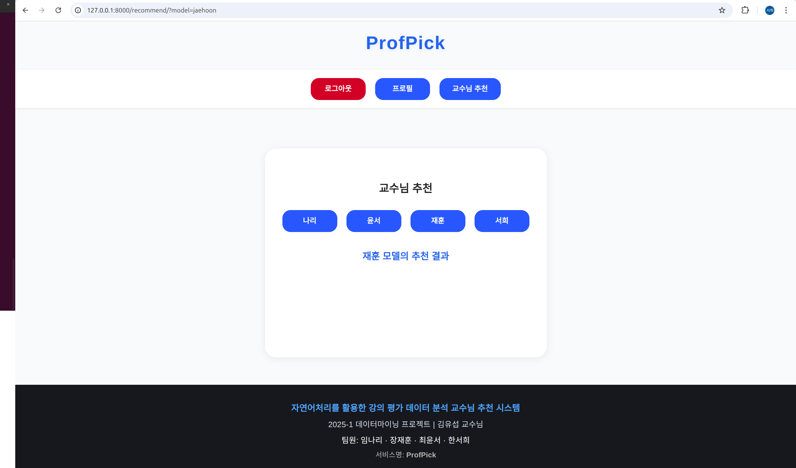

# ProfPick (Professor Pick)

### 자연어처리를 활용한 강의평가 데이터 분석 교수님 추천 서비스 
- **2025-1 데이터마이닝 기말 프로젝트** 
- **담당 교수:** 김유섭 교수님
  
소프트웨어학과 수업을 듣는 학생들을 대상으로 직접 설문 조사한 데이터와 에브리타임 강의평가 데이터를 활용하여,

교수님들에 대한 정보가 없는 신입생 및 재학생을 위해
학생 개개인에게 적잡한 교수님을 추천하는 시스템입니다.


---
## 목차
- [환경 정보](#환경-정보)
- [기능 소개](#기능-소개)
- [기술 스택](#기술-스택)
- [설치 및 실행 방법](#설치-및-실행-방법)
- [서버 실행](#서버-실행)
- [접속 방법](#접속-방법)
- [역할 분담](#역할-분담)
- [발표 자료](#발표-자료)

---

## 환경 정보

> 이 프로젝트는 Ubuntu 24.04.2 LTS (코드네임: noble) 기반 리눅스 환경에서 개발 및 테스트되었습니다.  
> Windows, MacOS에서도 실행 가능하지만, 일부 명령어는 다를 수 있으니 참고해 주세요.

---

## 기능 소개

<p align="center">
  
  
  
  
  
  
  
</p>

---

## 기술 스택
- Python 3.12.7  
- Django 5.2.1  
- SQLite (기본 데이터베이스)  
- 프론트엔드: HTML, CSS, JavaScript
---

## 설치 및 실행 방법

```bash
# Python 버전 확인 (3.12.7 권장)
python --version

# 프로젝트 폴더 생성 및 이동
mkdir professorpick
cd professorpick

# 가상환경 생성 및 활성화
python3 -m venv professorpick-env
source professorpick-env/bin/activate

# pip 최신 버전으로 업그레이드
pip install --upgrade pip

# Django 5.2.1 설치
pip install Django==5.2.1

# Django 버전 확인
django-admin --version
````
---
## 서버 실행
```bash
# Django 개발 서버 실행 (로컬 테스트용)
python manage.py runserver

# 실제 WebSocket 서비스용 ASGI 서버 실행 (Daphne)
daphne config.asgi:application
````
---
## 접속 방법
```bash
# 웹 브라우저에서 아래 주소로 접속하세요
echo "http://127.0.0.1:8000"
````
---
## 역할 분담

---
## 발표 자료
