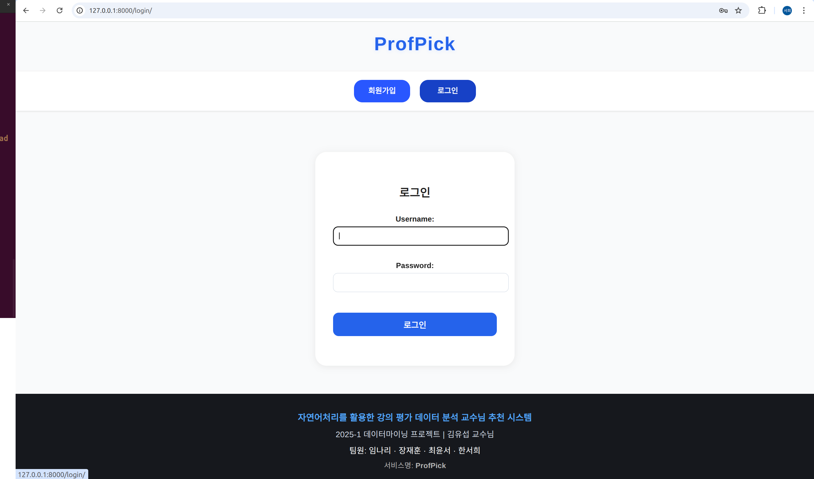

# ProfPick (Professor Pick)

### 자연어처리를 활용한 강의평가 데이터 분석 교수님 추천 서비스 
- **2025-1 데이터마이닝 기말 프로젝트** 
- **담당 교수:** 김유섭 교수님

---
## 프로젝트 소개
소프트웨어학과 수업을 듣는 학생들을 대상으로 **직접 설문 조사한 데이터**와 에브리타임 강의평가 데이터를 활용하여,

교수님들에 대한 정보가 없는 신입생 및 재학생을 위해
학생 개개인에게 적합한 교수님을 추천하는 시스템입니다.

(설문조사는 네이버폼으로 진행하였으며 소프트웨어학과 수업을 듣는 총 50명의 학생이 참여하였습니다)

---
## 프로젝트 후 느낀점

실습 수업에서는 항상 이미 준비된 데이터를 사용하지만, 

저희는 직접 데이터를 구해보고 **원시(raw) 데이터를 정리·가공**하는 전 과정을 경험해 보고 싶었습니다.

따라서 단순히 주어진 데이터를 다루는 데 그치지 않고, **실제로 데이터를 수집하고 전처리하는 과정**에 집중하였습니다.

이 과정을 통해 **빅데이터 시대에 ‘데이터’의 가치**를 몸소 느낄 수 있었습니다. 

어떤 데이터를 확보하느냐에 따라, 

그리고 어떤 형식으로 정리·전처리하느냐에 따라 분석 결과가 크게 달라진다는 것을 직접 체감했습니다.

기본적인 전처리(결측값 제거, 형식 통일)와 파일 통합을 완료한 뒤에는, 

동일한 데이터를 가지고 **팀원 각각이 다른 방식으로 추가 전처리**를 적용해 보았습니다. 

그 결과, 데이터 활용 방식에 따라 결과가 얼마나 다양하게 나타나는지를 확인할 수 있었고, 

이는 데이터 처리 전략의 중요성을 다시 한번 깨닫게 해 주었습니다.


---
## 목차
- [환경 정보](#환경-정보)
- [발표 자료](#발표-자료)
- [기능 소개](#기능-소개)
- [기술 스택](#기술-스택)
- [설치 및 실행 방법](#설치-및-실행-방법)
- [서버 실행](#서버-실행)
- [접속 방법](#접속-방법)

---

## 환경 정보

> 이 프로젝트는 Ubuntu 24.04.2 LTS (코드네임: noble) 기반 리눅스 환경에서 개발 및 테스트되었습니다.  
> Windows, MacOS에서도 실행 가능하지만, 일부 명령어는 다를 수 있으니 참고해 주세요.

---
## 발표 자료


---

## 기능 소개

### 교수님 추천 결과

<p align="center">
  <br>
</p>
<p align="center">
  <br>
</p>
<p align="center">
  <br>
</p>
<p align="center">
  <br>
</p>
<p align="center">
  <br>
</p>
<p align="center">
  <br>
</p>
<p align="center">
  <br>
</p>

---
### 기본 기능 구현
<p align="center">
  <br>
</p>
<p align="center">
  <br>
</p>
<p align="center">
  <br>
</p>
<p align="center">
  <br>
</p>
<p align="center">
  <br>
</p>

---

## 기술 스택
- Python 3.12.7  
- Django 5.2.1  
- SQLite (기본 데이터베이스)  
- 프론트엔드: HTML, CSS, JavaScript
- Pandas, NumPy (데이터 전처리)  
- scikit-learn (TF-IDF, 유사도 계산)  
- sentence-transformers: `snunlp/KR-SBERT-V40K-klueNLI-augSTS` (한국어 SBERT)  
- transformers (LLM 파이프라인)  
- KoNLPy(Komoran, Okt)  
- KeyBERT (키워드 추출)  
- WordCloud, networkx (워드클라우드 & 키워드 네트워크)  
- Matplotlib, Seaborn (시각화)
  
---

## 설치 및 실행 방법

```bash
# Python 버전 확인 (3.12.7 권장)
python --version

# 프로젝트 폴더 생성 및 이동
mkdir professorpick
cd professorpick

# 가상환경 생성 및 활성화
python3 -m venv professorpick-env
source professorpick-env/bin/activate

# pip 최신 버전으로 업그레이드
pip install --upgrade pip

# Django 5.2.1 설치
pip install Django==5.2.1

# Django 버전 확인
django-admin --version
````
---
## 서버 실행
```bash
# Django 개발 서버 실행 (로컬 테스트용)
python manage.py runserver

# 실제 WebSocket 서비스용 ASGI 서버 실행 (Daphne)
daphne config.asgi:application
````
---
## 접속 방법
```bash
# 웹 브라우저에서 아래 주소로 접속하세요
echo "http://127.0.0.1:8000"
````
---
